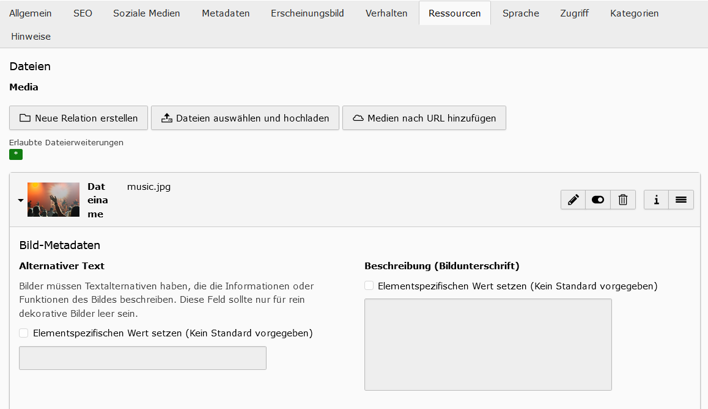

# Background-Slider
In the frontend you can add a background-slider over the whole page.
You can add for every page another slider.

## Add Page Resources
To add images to the background slider, you need to go to the page-settings and change into the tab 'Resources'. 
In the resources you can add an image-reference.
