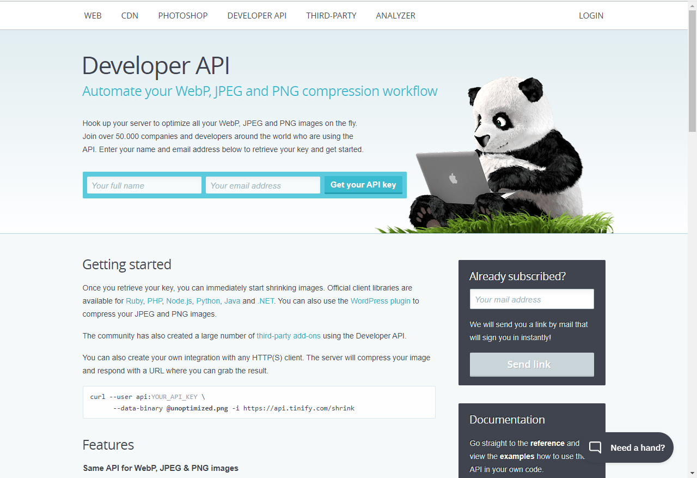
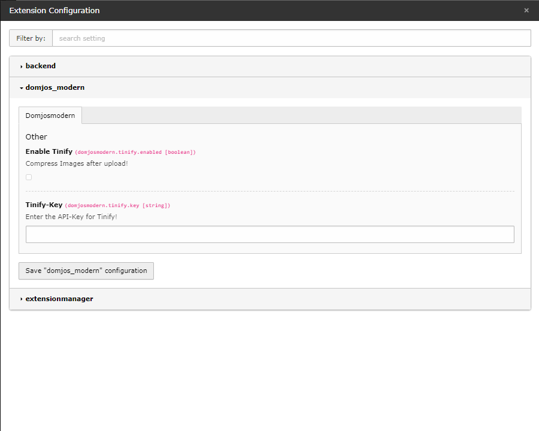

# Compress Images
The template makes it possible to compress images on upload automatically. To do that, it uses the webservice [tinify](https://tinify.com).

## Installation
To enable the compression, you need an Api-Key of the service. On the website go to Api and generate one.

In Typo3 go to the settings, click on Extension Configuration and open the settings of "domjos_modern".

Click on enable and enter your API-Key.

## Test
To test the compression upload an image and check the messages arriving at the screen. If following message is visible, the compression works.
