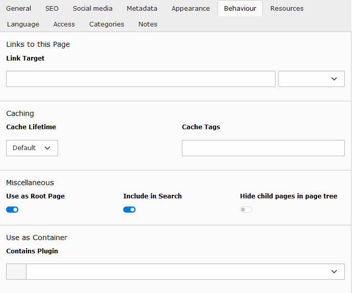
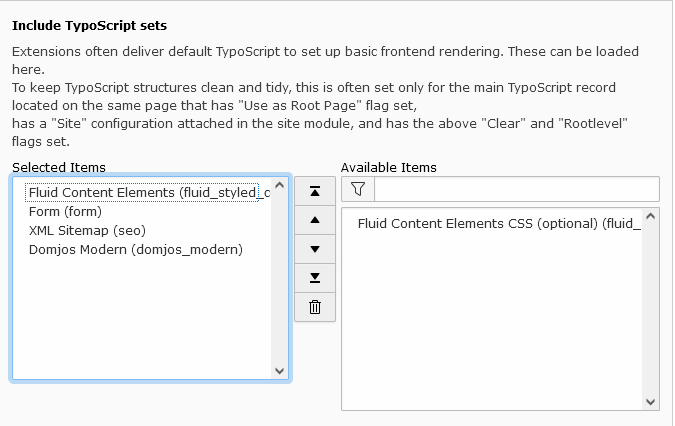

# Installation

## 1. Copy Template and enable it
Copy the Source of the template in the ext folder of the Typo3-Installation. 
``typo3conf/ext`` 
You should name the folder into ``domjos_modern``.
Go to the Extensions-Part of Typo3 and enable the Extension `` Modern Domjos-Typo3-Template``.

## 2. Root Page
Create a first page in the Typo3-Page-Tree and open the Page-Settings.

Enable the Setting ``Use as Root Page``.

## 3. Install Template
Go to Typoscript and add a new Template-Record. Delete the Example-Content in the Setup-Part.
Open the ``Edit the whole Typoscript record`` and include the extension-entries:

## 4. Resources
Go to the Page-Settings of the first page again. Change to the Tab ``Resources`` and include all static Page TSconfig.