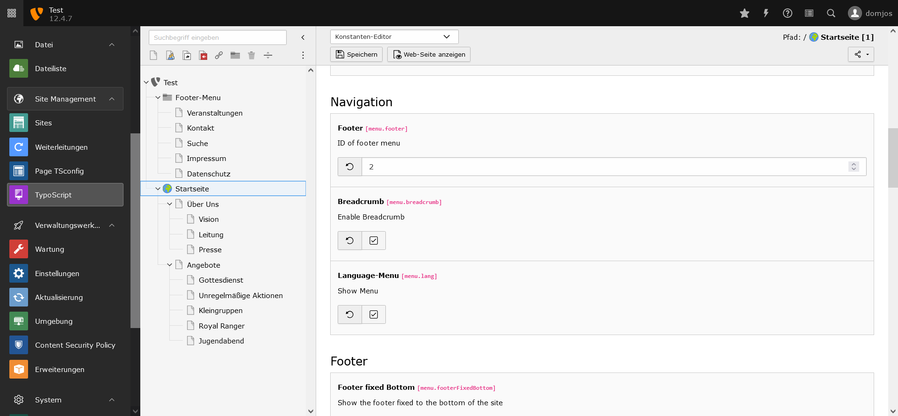
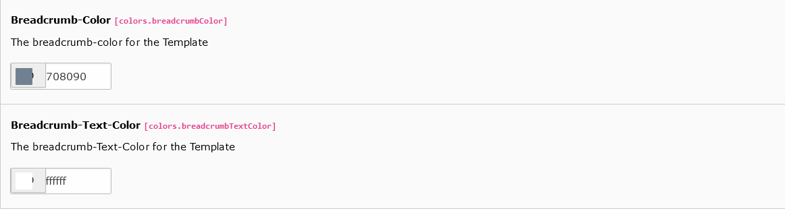

# Breadcrumb
A Breadcrumb shows the depth of the navigation.

For example the structure of the website is as follows:
- Level 1
- Level 2
  - Level 2.1
    - Level 2.1.1
  - Level 2.2

When you are on the page Level 2.1.1, the Breadcrumb shows: 
<b>Level 2 / Level 2.1 / Level 2.1.1</b>

# 1. Enable Breadcrumb
Go into the constant-editor and enable the breadcrumb.

# 2. Options
In the constant-editor you can change the text- and background-color of the breadcrumb.

# 3. Preview

