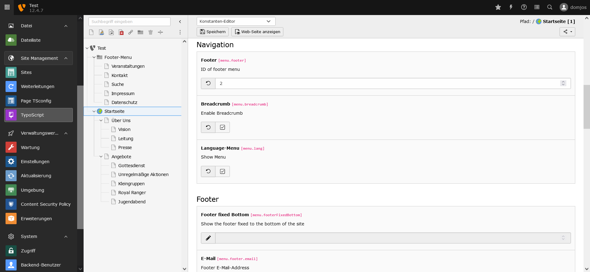
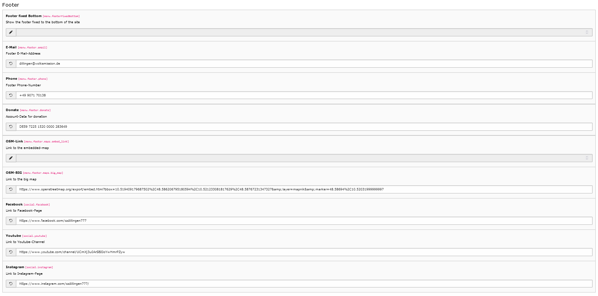

# Footer-Menu
In the footer next to the breadcrumb there is the footer-menu. It contains some important pages,
social media links, contact-data and a map to an address.

## 1. Enable Footer-Menu
<a name="sub"/>You can add the settings in the constant-editor. To add pages to the menu you need to add the pages into a directory and enter the uid to the constant in the constant editor.

## 2. Options
You can configure the footer with several options.

<table>
    <thead>
        <tr>
            <th>Category</th>
            <th>Option</th>
            <th>Description</th>
        </tr>
    </thead>
    <tbody>
        <tr>
            <td>Option</td>
            <td>Footer Fixed Bottom</td>
            <td>When enabled the Menu is fixed to the footer, which means the menu is at the button though the content is not full.</td>
        </tr>
        <tr>
            <td>Contact</td>
            <td>E-Mail</td>
            <td>The E-Mail-Address for the contact of the website.</td>
        </tr>
        <tr>
            <td>Contact</td>
            <td>Phone</td>
            <td>The Phone-Address for the contact of the website.</td>
        </tr>
        <tr>
            <td>Contact</td>
            <td>Donate</td>
            <td>The Donation-Account for the contact of the website.</td>
        </tr>
        <tr>
            <td>Map</td>
            <td>OSM-Link</td>
            <td>The link to the Open-Street-Map-Card.</td>
        </tr>
        <tr>
            <td>Map</td>
            <td>OSM-Big</td>
            <td>The link to the Open-Street-Big-Map.</td>
        </tr>
        <tr>
            <td>Social</td>
            <td>Facebook</td>
            <td>The link to the facebook-page.</td>
        </tr>
        <tr>
            <td>Social</td>
            <td>Youtube</td>
            <td>The link to the Youtube-Channel.</td>
        </tr>
        <tr>
            <td>Social</td>
            <td>Instagram</td>
            <td>The link to the Instagram-Page.</td>
        </tr>
    </tbody>
</table>