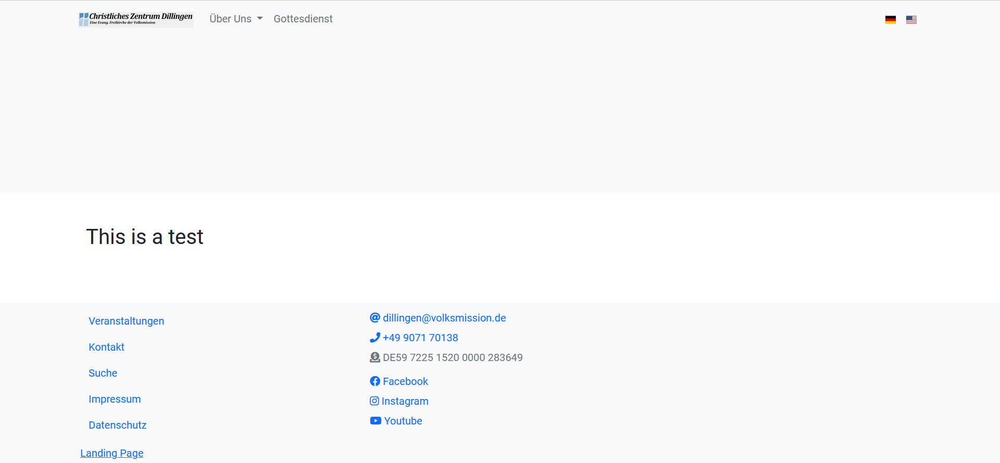
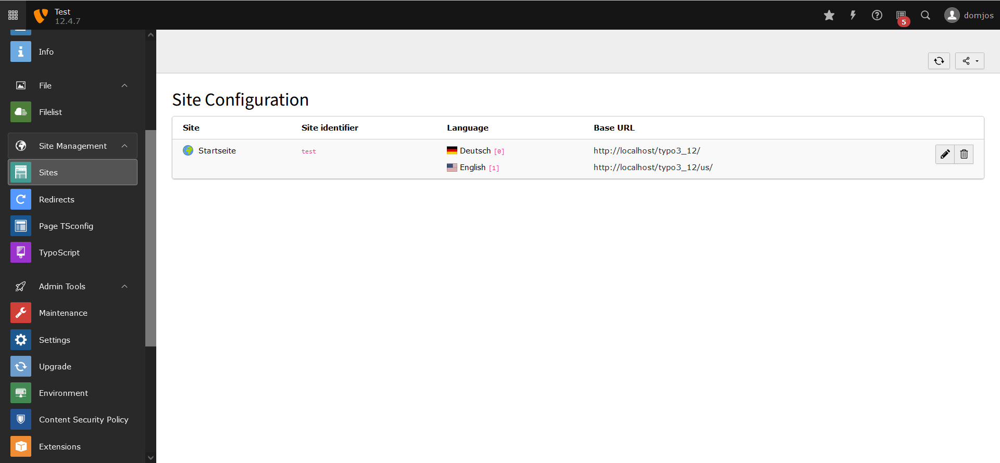
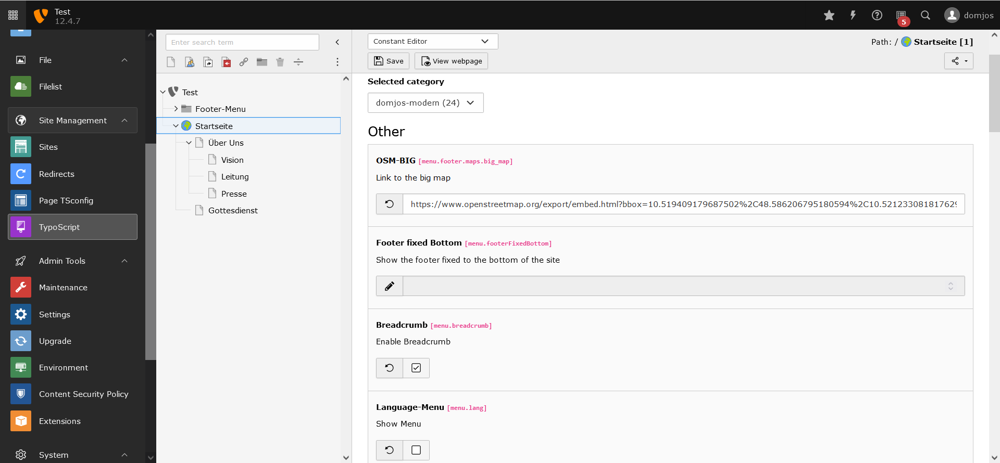

# Language-Menu
The Template supports Multi-Language-Support. To activate it, enable the constant in the Typo3-Template.

## Frontend

## Installation

### 1. Configure the Sites Module

In the first Step you have to create multiple Languages in the Sites-Module.
The Language need a unique domain-extension.
For example: 
German: https://test.de/de/ 
US: https://test.de/us/ 
<b>It is important to add the / at the end of the url.</b>

### 2. Configure the Constants

To enable the Language-Menu check the constants menu.lang